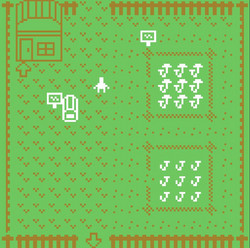

This project created in [itch.io - 2021 December Bitsy jam](https://itch.io/jam/mushrooms-bitsy/rate/1335677) for the theme `Mushroom`

## Harvest Mushroom

A mushroom farming simulation game.

During the mushroom harvest festival, you manager a farm with fields for planting mushrooms. You can also go into the forest for gathering wild mushrooms. Then sell mushrooms for money. Finally, hold enough money for win-the-game!

### release

The single `.html` file. [Online play](https://hundun.itch.io/harvest-mushroom)

### How to play

Only need direction keys, or touch different directions on phone screen.

Right-direction means comfirm in choice dialogs.

### Game Dev Engine

[Bitsy](https://make.bitsy.org/) and load hacks by [borksy](https://ayolland.itch.io/borksy).

#### Used hacks:
- dialog choices (by Sean S. LeBlanc)
- dialog jump (by Sean S. LeBlanc)
- edit image from dialog (by Sean S. LeBlanc)
- exit-from-dialog (by @mildmojo)
